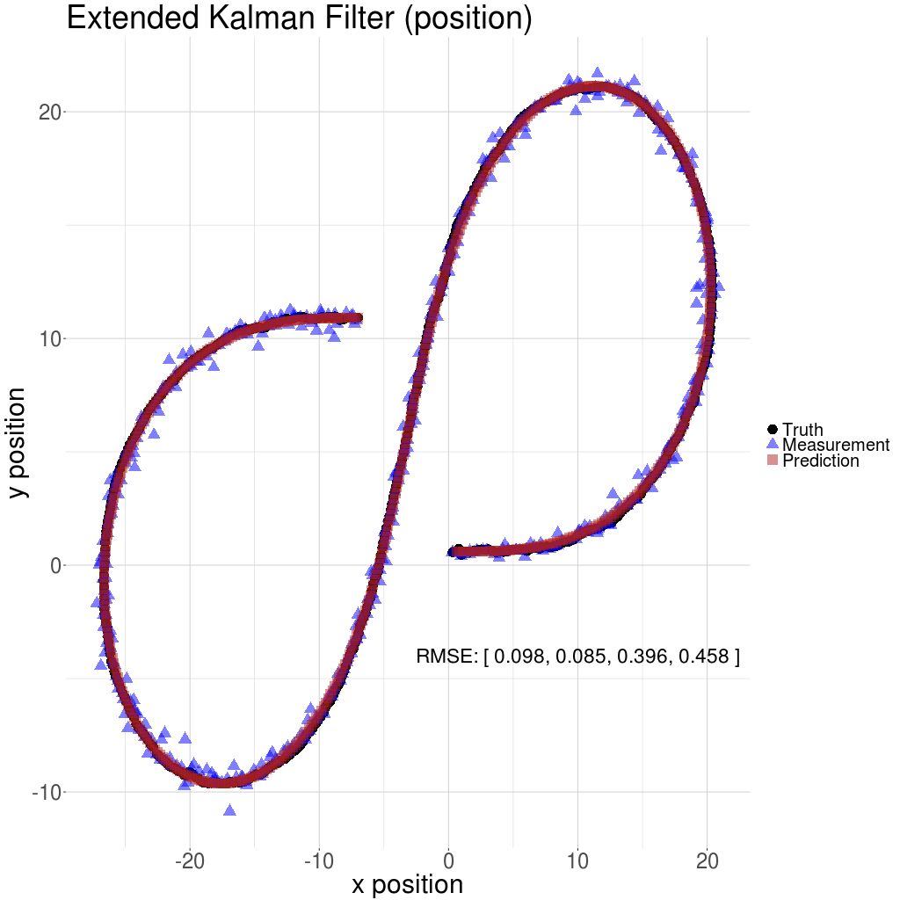

# SDCND Extended Kalman Filter

This project is part of the Udacity self-driving car engineer nanodegree.  
Some template code was  provided  by Udacity. Here, apart from minor modifications, the overall architecture of the template was retained for the sake of consistency and ease of evaluation. 

## Results
The Extended Kalman Filter is applied to the sample data provided by Udacity, **note that the second "new" set of sample data is used here.** The results are plotted below (see `viz.R`). 

The RMSE values, shown on the figure, are within within the accepted range.

